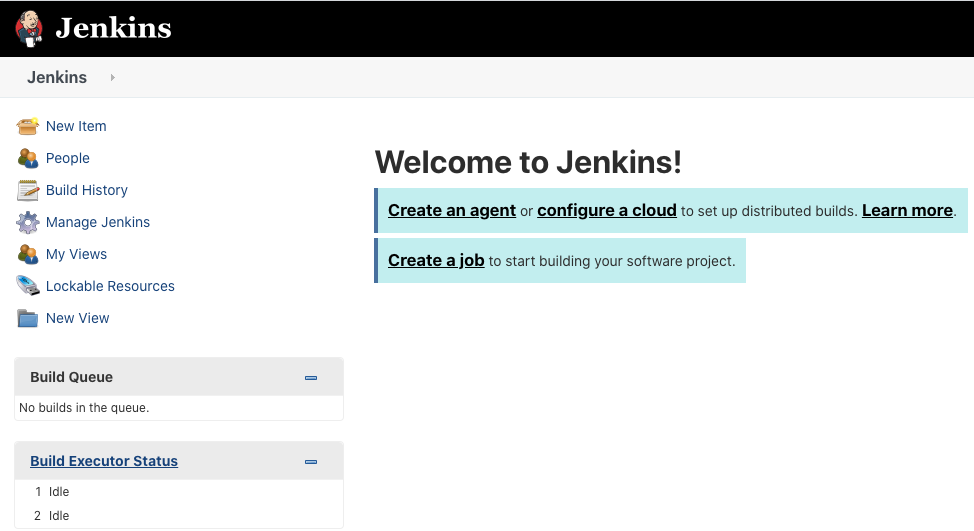

# Deploy Jenkins on Kubernetes

This repo allow you deploy Jenkins on your Kubernetes cluster. To deploy it you have to do the follow steps.

## Deploy on Kubernetes

1. Create a namespace:

```bash
    kubectl create namespace jenkins
```

2. Deploy yaml files:

```bash
    kubectl create -f deployment-jenkins.yaml --namespace jenkins

    kubectl create -f services-jenkins.yaml --namespace jenkins
```

## Get the Jenkins UI

* Now you can do a portforward pod with the deployment pod name (kubectl get pods --namespace jenkins)

```bash
    kubectl port-forward pods/<pod-name> 8888:8080 -n jenkins
```

* You also using a ingress and redirect to Jenkins service

* Now go to http://localhost:8888 and put the admin password. Finally enjoy Jenkins.

The get the admin password for Jenkins:

```bash
    kubectl logs <deployment-pod-name>
```

You should have something like:

```bash
Running from: /usr/share/jenkins/jenkins.war
webroot: EnvVars.masterEnvVars.get("JENKINS_HOME")
. . .

Jenkins initial setup is required. An admin user has been created and a password generated.
Please use the following password to proceed to installation:

your_jenkins_password

This may also be found at: /var/jenkins_home/secrets/initialAdminPassword
```

Enjoy Jenkins.


## Reference

https://www.digitalocean.com/community/tutorials/how-to-install-jenkins-on-kubernetes
